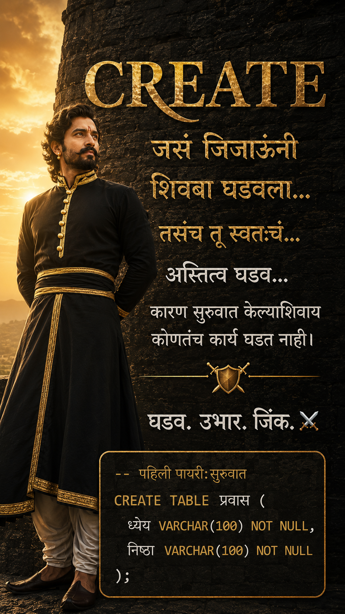

# दिवस १: CREATE - अस्तित्व घडवणं ⚔️

<p align="center">
  
</p>

## 🏰 मराठा गोष्ट
जिजाऊ साहेबांनी शिवबांना बालपणीच स्वराज्याचे धडे दिले. 'लाल महालात' बसून त्यांनी शस्त्र, शास्त्र आणि राजनीती शिकवली. हीच खरी 'सुरुवात' होती. **स्वराज्य उभं करायचं तर पहिल्यांदा त्याचं 'अस्तित्व' घडवावं लागतं.**

## 💻 SQL संकल्पना: CREATE
`CREATE` हा आदेश डेटाबेस मध्ये नवीन गोष्टी बनवण्यासाठी वापरतात. **आज आपण २ गोष्टी बनवणार:**
1.  `DATABASE` - आपलं स्वराज्य
2.  `TABLE` - मावळ्यांची नोंद ठेवायला

## 🔥 SQL कोड - दिवस १

```sql
-- पायरी १: स्वराज्य नावाचा डाटाबेस बनवूया
CREATE DATABASE Swarajya;

-- पायरी २: स्वराज्य वापरायला सुरु करूया
USE Swarajya;

-- पायरी ३: मावळे साठी टेबल बनवूया
CREATE TABLE Mavale (
    Mavla_ID INT,
    Naav VARCHAR(50),
    Talwar VARCHAR(50),
    Killa VARCHAR(50)
);